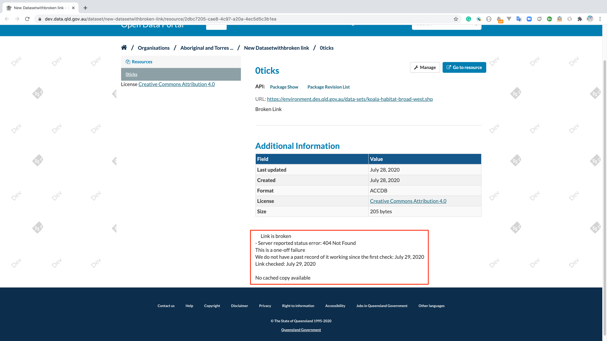

.. You should enable this project on travis-ci.org and coveralls.io to make
   these badges work. The necessary Travis and Coverage config files have been
   generated for you.

.. image:: https://travis-ci.org/ckan/ckanext-qa.svg?branch=master
    :target: https://travis-ci.org/ckan/ckanext-qa

CKAN QA Extension (Quality Assurance)
=====================================

The ckanext-qa extension will check each of your dataset resources in CKAN and give
them an 'openness score' based Tim Berners-Lee's five stars of openness
(http://lab.linkeddata.deri.ie/2010/star-scheme-by-example)

The openness score is displayed as stars on the dataset and resource pages.

.. image:: qa_dataset.png
    :alt: Stars on the dataset

.. image:: qa_resource.png
    :alt: Stars spelled out on the resource

It also provides a report that allows you to view the openness (stars ratings) across a publisher or across them all:

.. image:: qa_report.png
    :alt: Openness report (star ratings) for a publisher

Requirements
------------

Before installing ckanext-qa, make sure that you have installed the following:

* CKAN 2.1+
* ckanext-archiver 2.0+ (https://github.com/ckan/ckanext-archiver)
* ckanext-report (https://github.com/datagovuk/ckanext-report) for reporting

Known issues:

* if the CKAN version is earlier than 2.3 then QA and Archiver information will not display on the resource read page.

Installation
------------

To install ckanext-qa, ensure you have previously installed ckanext-archiver (v2.0+) and ckanext-report and then:

1. Activate your CKAN virtual environment, for example::

     . /usr/lib/ckan/default/bin/activate

2. Install the ckanext-qa Python package into your virtual environment::

     pip install -e git+http://github.com/okfn/ckanext-qa.git#egg=ckanext-qa

3. Install the qa dependencies::

     pip install -r ckanext-qa/requirements.txt

4. Now create the database tables::

     paster --plugin=ckanext-qa qa init --config=production.ini

5. Add ``qa`` to the ``ckan.plugins`` setting BEFORE ``archiver`` in your CKAN
   config file (by default the config file is located at
   ``/etc/ckan/default/production.ini``).

6. Restart CKAN. For example if you've deployed CKAN with Apache on Ubuntu::

     sudo service apache2 reload

Upgrade from version 0.1 to 2.x
-------------------------------

NB You should upgrade ckanext-archiver and ckanext-qa from v0.1 to 2.x in one go. Upgrade ckanext-archiver first and then carry out the following:

1. Activate your CKAN virtual environment, for example::

     . /usr/lib/ckan/default/bin/activate

2. Upgrade the ckanext-qa Python package::

     cd ckanext-qa
     git pull
     python setup.py develop

3. Create the new database tables::

     paster --plugin=ckanext-qa qa init --config=production.ini

4. Install the normal and developer dependencies::

     pip install -r requirements.txt
     pip install -r dev-requirements.txt

5. Migrate your database to the new QA tables::

     python ckanext/qa/bin/migrate_task_status.py --write production.ini

6. (Re)start the `paster celeryd2 run` processes described for ckanext-archiver.

Configuration
-------------

You must make sure that the following is set in your CKAN config::

    ckan.site_url = <URL to your CKAN instance>

Optionally you can configure a different set of scores to award each resource format::

    qa.resource_format_openness_scores_json = <filepath>

The default value is `resource_format_openness_scores.json`)

Running
--------

First, make sure that Celery is running for the priority and bulk queues. This is explained in the ckanext-archiver README:

[Using Archiver](https://github.com/ckan/ckanext-archiver#using-archiver)

QA is performed when a dataset/resource is archived, or you can run it manually using a paster command::

    paster --plugin=ckanext-qa qa update [dataset] --config=production.ini

Here ``dataset`` is a CKAN dataset name or ID, or you can omit it to do the QA on all datasets.

For a full list of manual commands run::

    paster --plugin=ckanext-qa qa --help

Once the QA has run for a dataset, you will see the stars displayed on the dataset's web page, and the detected file format available when you call `package_show` for it, in the `qa` for the dataset and each resource.

You can get an overall picture by generating an Openness report::

    paster --plugin=ckanext-report report generate openness --config=production.ini

And view it on your CKAN site at ``/report/openness``.

Tests
-----

To run the tests:

1. Activate your CKAN virtual environment, for example::

     . /usr/lib/ckan/default/bin/activate

2. If not done already, install the dev requirements::

    (pyenv)~/pyenv/src/ckan$ pip install ../ckanext-qa/dev-requirements.txt

3. From the CKAN root directory (not the extension root) do::

    (pyenv)~/pyenv/src/ckan$ nosetests --ckan ../ckanext-qa/ckanext/qa/tests/ --with-pylons=../ckanext-qa/test-core.ini

If you get error "MagicException: None" then it may be due to libmagic needing an update. Try:

    sudo apt-get install libmagic1

Translations
------

To translate plugin to a new language (ie. "pl") run `python setup.py init_catalog -l pl`.

To update template file with new translation added in the code or templates
run `python setup.py extract_messages` in the root plugin directory. Then run
`./ckanext/qa/i18n/unique_pot.sh -v` to strip other plugin's translations.

To update translation files for locale "pl" with new template run `python setup.py update_catalog -l pl`.

Questions
---------

The archiver info shows on the dataset/resource pages but the QA doesn't
~~~~~~~~~~~~~~~~~~~~~~~~~~~~~~~~~~~~~~~~~~~~~~~~~~~~~~~~~~~~~~~~~~~~~~~~

You need to ensure that in your ``ckan.plugins`` you have ``qa`` listed BEFORE ``archiver`` or else the template inheritance doesn't work and this happens.

The qa does not have ratings for dataset/resource
~~~~~~~~~~~~~~~~~~~~~~~~~~~~~~~~~~~~~~~~~~~~~~~~~

A brief background on the workflow of the ``archiver`` and ``qa``  extensions when a dataset is created or updated to attempt to explain what is going on here.

When a dataset gets created or updated the following steps happened:

#. CKAN sends a ``notify`` event to the ``archiver`` extension with the dataset and resources metadata to tell it something has happened to this dataset

#. The archiver then has some logic to check if this dataset needs to be archived

   #. Is it a new dataset

   #. Has the ‘license’ changed since last archival

   #. Any resources that have been ‘added’ or ‘removed’

   #. Any resources have changed their ‘URL’ or ‘format’

#. If any of the conditions are met above it adds a background task to archive the dataset’s resources

   #. For each resource, it will create an archive record

      #. If the resource is a file upload, it does not need to download the file

         #. Creates an archive record referencing the resource file uploaded

      #. If the resource is an external URL link, it will attempt to download the file

         #. If successful at downloading the external resource, it will create an archive record referencing the locally cached copy of the resource file and ``"status": "Archived successfully"``

         #. If unsuccessful at downloading external resource it will create an archive record with ``"status": "Download error"``

   #. If any resources have the status ``"status": "Archived successfully"`` the archiver extension will broadcast an event ``package-archived`` to the ``qa`` extension

      #. The ``qa`` extension will then analysis the resource file to determine the file format, either from the file uploaded or the downloaded cached copy of the external resource.

      #. If the ``qa`` extension is successfully in determining the file format type, it will apply the format score from the ``resource_format_openness_scores.json`` file

As you can see in the above scenario the broken link resource is not successfully archived so the ``archiver`` never sends an event to the ``qa`` extension to apply a score on the resource. If there was a another resource for this dataset which was successfully archived (via a file uploaded or external resource without a broken resource link) it would send an event to the qa extension and calculate a score for the dataset.

I believe this is by design because the ``qa`` needs a local copy of the file to determine the file format and if the resource has a broken link this is not possible.

As a general business practise no one should be really creating a new resource with a broken link and if they did so unintentionally this information is shown on the resource page letting the dataset creator aware that the link is broken.

